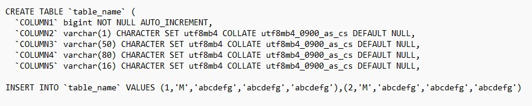
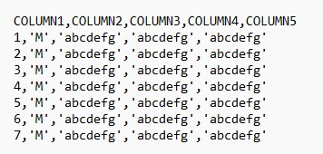
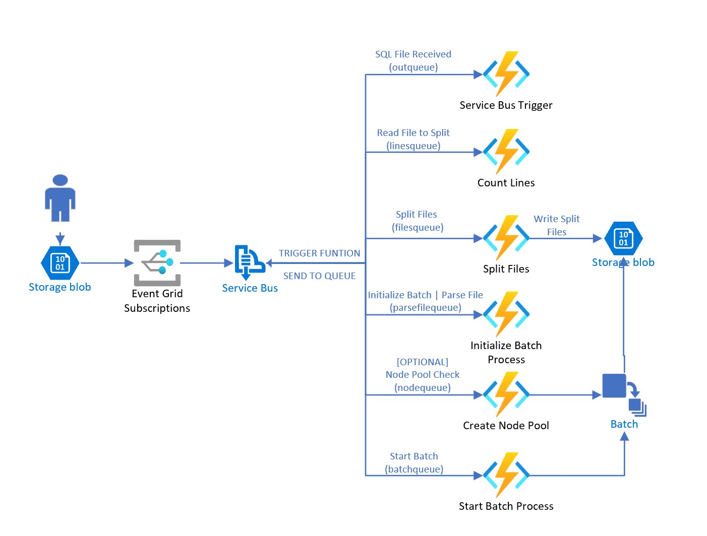

**TODO LIST**
- Add VNET
- Deploy.json - Disable Public Access Storage Account


## Solution Overview
This solution will ingest MySQL files and convert these files to CSV files. THis has been tested in Azure Government. So some endpoints will need to be modified for Azure Commercial.

Here is a sample MySQL file.




This is an example of final result after converting the MySQL file above. The file will be named after the table in csv format. This solution will also factor in single and double quotes. 




The solution converts large .sql files that can be multiple GBs. The solution will use several techniques that are described below to understand how these large files are processed. From a high-level, the main 3 steps are: 
- Split the large files into smaller files
- Assign Job tasks to parse each file
- Extract all parsed files and output to csv files based off table names



The sample is derived from the [Azure Batch Samples](https://github.com/Azure-Samples/azure-batch-samples/tree/master/CSharp/TextSearch) and has been modified to use Function Apps, Services Bus, etc for event driven solution and leveraging storage accounts and managed identities. 


### Split Files
The splitting of files will adhere to the [**Async Request-Reply** pattern](https://learn.microsoft.com/en-us/azure/architecture/patterns/async-request-reply?source=recommendations). This is solution is derived from this current [sample](https://github.com/mspnp/cloud-design-patterns/tree/master/async-request-reply).
> Note that this could use Azure Container Instance, AKS, Azure Batch with Containers(Shipyard), and other services. This is just one implementation to demo how this is done. 


### Azure Batch Process

Once the files are split, each file is parsed with individual tasks in a job. The job has the same name as the file. For example, the "sample.sql" file is split into 3 files: sample.sql_0.txt, sample.sql_1.txt. A Mapper task will process a specific file. There will be 3 Mapper tasks and 1 additional task, **Reducer**, to take the output from all the Mapper task to convert the output into csv files for each table. 

> If the file was already processed, it will not execute again unless the file is renamed or the job is deleted. 

#### Settings

- **Batch_Base_Url** - URL of the Batch account
- **Batch_Account_Name** - Name of the Batch account
- **Batch_Key** - Keys to authentication with the Batch account for the management API
- **File_Storage_Url** - The storage account location of the split files once the large file is received
- **Application_Package_Name** - Application package that contains the exe and other resources files to parse and convert the files from sql to csv format on Azure Batch
- **Application_Package_Version** - Current version of the application package. If the version is changed after deployment, the application package will need to be uploaded and set to default. Then the node pool will need to be restarted to pull and install the new version. 

- **File_Storage_Container** - The storage account container location of the split files once the large file is received
- **User_Assigned_Managed_IdentityID** - Full ID of the User Assigned Managed Identity for the Batch Account, Function App, Storage Accounts, and Node Pools to authenticate. 
- **Batch_Input_Container_Url** - Mapper Tasks will convert the format to csv, which will be storage in this container location. 
- **Batch_Output_Container_Url** - The Reducer Task will output the final csv files to this container location. 
- **Task_Number** - The number of files, nodes, and tasks. 
- **Application_PackageID** - Full ID of the application package
- **User_Assigned_Managed_Identity_ClientID** - Client ID of the User Assigned Managed Identity
- **Batch_Management_Endpoint** - Batch Management endpoint for creating the node pool. This is Azure Government specific. 
- **SubscriptionID** - Current subscription that the Batch Management API requires. 
- **Resource_Group_Name** - Current resource group that the Batch Management API requires.


#### Node Pool
The current Node Pool configurations is for 2022-datacenter for a specific .NET version. This will need to be updated to have a start task to install the .NET version for this application if need to update the .NET or OS version. 

##### Settings for Node Pool

- **Job_File_Retention_Hours** - Number of hours to keep task files on the node for a specific job. This will help clean up files so the nodes do not become unusable if the disk is full. 

- **VM_Size** - The default Size is Standard_D4s_v3, which is SSD for IOPS performance for reading and writing files. This can be modified to increase the VM size or using the High Performance VMs.


## Installation

Start with the [Deploy script](https://github.com/demouniversity/ConvertMySQLFiles/blob/main/Scripts/Deploy.ps1). 
- Execute the code to deploying the ARM template 
```
az deployment group create -g "$rg" -f .\Templates\deploy.json
```
- After the deployment is completed then upload the package. 
    - Obtain the package from the [MySQLParser repo](https://github.com/demouniversity/MySQLparser) or use the zip file directly [here.](https://github.com/demouniversity/MySQLparser/blob/main/mysqlparser/mysqlparser.zip). The repo build will copy all the needed files in the mysqlparser directory in the solution, which can be zipped. Make sure all files are at the root of the zip file. e.g. mysqlparser -> *.dll

```
az batch application package create
```

- When the application is uploaded to Azure Batch, it needs to be set as the default. Execute the next PowerShell cmdlet in the script.

```
Set-AzBatchApplication
```

- Deploy the function app in the **src** directory.
- Upload a .sql file to the **data** container. 

> Ensure the event subscription on the data storage account is only triggered by .sql files and the **data** container. 

```
"filter":
{
    "subjectBeginsWith": "/blobServices/default/containers/mycontainer/blobs/log",
    "subjectEndsWith": ".jpg",
    "enableAdvancedFilteringOnArrays": true
}
```


## Considerations
At first glance, a function calling a function would seem to be the most direct route. This solution follows the best practice via leveraging queues for cross-function communication. See this [doc] (https://learn.microsoft.com/en-us/azure/azure-functions/performance-reliability#cross-function-communication) for more information. 

Service Bus Queues with Functions use a polling method. This POC uses Service Bus Queues. If you find there are performance degradations with this solution, one area that could be modified is to use a push model that will be entirely event-driven. This solution can be event driven by replacing the Service Bus Queue components with Event Grid. 

Today, this solution assumes that the correct version of .NET is installed. It is highly recommended to install .NET on the nodes, if you need other versions. This can be done with a custom build or startup tasks. 

Other considerations:
- This solution is derived from the Azure Batch Samples and can be updated to the latest .NET
- This is a POC and does not incorporate extensive error handling. Add error handling especially with parsing, Azure Batch, such as unstable nodes. 
- Add checks for duplicate files and transient errors (Circuit Breaker Pattern)
- Add additional security. This solution will demonstrate how to use Managed Identities for Azure Batch and Nodes with Storage Accounts, but could also be enhanced with additional security for the Azure Batch management API, etc.


## Resources

Why Azure Batch? [link](https://learn.microsoft.com/en-us/azure/architecture/example-scenario/iot/batch-integration-azure-data-factory-digital-twins#alternatives)

How to scale Azure Batch?  [See the Azure Batch links](https://learn.microsoft.com/en-us/azure/architecture/example-scenario/iot/batch-integration-azure-data-factory-digital-twins#performance)

[Reduce Polling with Event Grid](https://learn.microsoft.com/en-us/azure/event-grid/compare-messaging-services)